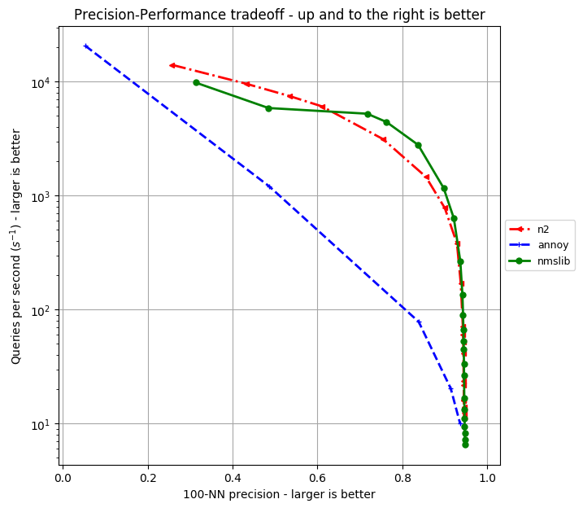
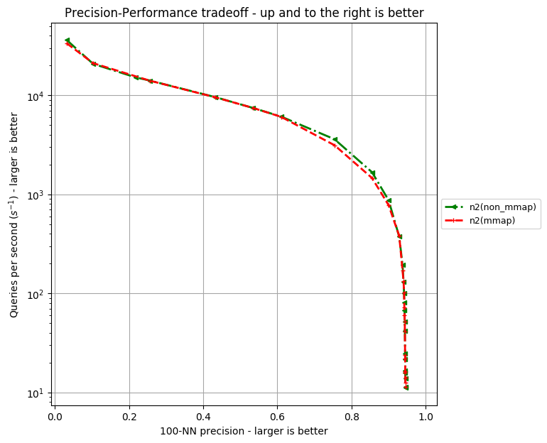

N2 Benchmark explanation
========================

Benchmark Focus
---------------

First, the new approximate nearest neighborhoods algorithm should run
faster for large datasets. Second, online content services like news
portal, where dataset is frequently updated(e.g. create/update/delete),
building the index file should be done in minimum time. Therefore, these
are our main criteria:

-  How long does it take to build the index file?
-  How long does it take to get results from the large dataset?
-  How large memory does it take to run large dataset?

Test dataset
------------

Dataset description
~~~~~~~~~~~~~~~~~~~

The dataset consists of two files. ``youtube.txt`` contains 14520986
samples, each sample has 40 data points.

+-------------------+-------------------+----+-------------------+--------------------+
| feature1(float32) | feature2(float32) | …… | feature2(float32) | feature40(float32) |
+===================+===================+====+===================+====================+
|     -0.167898     |     0.160478      | …… |    0.104421       |    0.0503584       |
+-------------------+-------------------+----+-------------------+--------------------+

``youtube.txt.vids`` is a metadata informations of the dataset. Each
line is the metadata corresponding to each sample of ``youtube.txt``.

+------------------+-------------+-------------------------------------------+
|       DSID       |     VID     |              Youtube link                 |
+==================+=============+===========================================+
|34XnPr4YKpo8wE_mEl| Z1Jilm0TZHY | http://www.youtube.com/watch?v=Z1Jilm0TZHY|
+------------------+-------------+-------------------------------------------+

How to get it
~~~~~~~~~~~~~

We share our dataset through `google
drive <https://drive.google.com/open?id=1B3PWRTb8xol9fEkawVbpfitOsuwXkqss>`__.

Index build times
-----------------

|image0|

Generally N2 is faster than the nmslib to build index file. Compared to
the annoy, N2 begins to show the similar performance of the annoy when
N2 uses 5 threads, and from then on it shows a faster build performance
than the annoy.

+-----------+--------------+-------------+-------------+-------------+
| Library   | 1 thread     | 5 threads   | 10 threads  | 20 threads  |
+===========+==============+=============+=============+=============+
| N2        | 4505.3669540 | 1002.475105 | 591.6419599 | 478.1210601 |
| (3.1Gb)   | 9            | 05          | 06          | 33          |
|           | sec          | sec         | sec         | sec         |
+-----------+--------------+-------------+-------------+-------------+
| nmslib    | 7130.7202520 | 1453.570172 | 826.9151070 | 602.1200079 |
| (3.4Gb)   | 4            | 07          | 12          | 92          |
|           | sec          | sec         | sec         | sec         |
+-----------+--------------+-------------+-------------+-------------+
| annoy     | 915.41107487 | 915.4110748 | 915.4110748 | 915.4110748 |
| (4.4Gb)   | 7            | 77          | 77          | 77          |
|           | sec          | sec         | sec         | sec         |
+-----------+--------------+-------------+-------------+-------------+

Search speed
------------

|image1|

+----------+-------------------+---------------------+--------------+------------------+
| efSearch | N2 search speed   | nmslib search speed | N2 precision | nmslib precision |
+==========+===================+=====================+==============+==================+
| 5        | 2.96617507935e-05 | 0.0001241928339     | 0.031194     | 0.215469         |
+----------+-------------------+---------------------+--------------+------------------+
| 10       | 4.72375869751e-05 | 0.000101833462715   | 0.102867     | 0.312599         |
+----------+-------------------+---------------------+--------------+------------------+
| 20       | 6.63484334946e-05 | 0.000145085191727   | 0.217592     | 0.439502         |
+----------+-------------------+---------------------+--------------+------------------+
| 25       | 7.97075986862e-05 | 0.000150768065453   | 0.256263     | 0.484542         |
+----------+-------------------+---------------------+--------------+------------------+
| 50       | 0.000105100750923 | 0.000202376317978   | 0.432235     | 0.636066         |
+----------+-------------------+---------------------+--------------+------------------+
| 75       | 0.000133629846573 | 0.000191029930115   | 0.533808     | 0.717139         |
+----------+-------------------+---------------------+--------------+------------------+
| 100      | 0.000164681959152 | 0.00022577457428    | 0.610392     | 0.762642         |
+----------+-------------------+---------------------+--------------+------------------+
| 200      | 0.0003175532341   | 0.000410567188263   | 0.754384     | 0.837223         |
+----------+-------------------+---------------------+--------------+------------------+
| 500      | 0.000591496443748 | 0.000856725335121   | 0.855499     | 0.897412         |
+----------+-------------------+---------------------+--------------+------------------+
| 1000     | 0.00128344593048  | 0.00158099501133    | 0.900158     | 0.921548         |
+----------+-------------------+---------------------+--------------+------------------+
| 2500     | 0.00262923879623  | 0.0037698725462     | 0.928874     | 0.936815         |
+----------+-------------------+---------------------+--------------+------------------+
| 5000     | 0.00589108946323  | 0.00743386442661    | 0.937833     | 0.941768         |
+----------+-------------------+---------------------+--------------+------------------+
| 7500     | 0.00756142992973  | 0.011111637044      | 0.940585     | 0.943269         |
+----------+-------------------+---------------------+--------------+------------------+
| 10000    | 0.00992864563465  | 0.014903024435      | 0.941907     | 0.944093         |
+----------+-------------------+---------------------+--------------+------------------+
| 12500    | 0.0139706285238   | 0.0188002112389     | 0.942683     | 0.94457          |
+----------+-------------------+---------------------+--------------+------------------+
| 15000    | 0.0146648518085   | 0.0223202088118     | 0.943166     | 0.944905         |
+----------+-------------------+---------------------+--------------+------------------+
| 20000    | 0.0191933099508   | 0.0299149288177     | 0.943761     | 0.945407         |
+----------+-------------------+---------------------+--------------+------------------+
| 25000    | 0.0236727333307   | 0.037727153492      | 0.944114     | 0.94562          |
+----------+-------------------+---------------------+--------------+------------------+
| 40000    | 0.0369906538248   | 0.0606474931717     | 0.944708     | 0.946154         |
+----------+-------------------+---------------------+--------------+------------------+
| 50000    | 0.0457890226126   | 0.0752312460184     | 0.944937     | 0.946553         |
+----------+-------------------+---------------------+--------------+------------------+
| 60000    | 0.0615395376682   | 0.0909772757292     | 0.945106     | 0.946851         |
+----------+-------------------+---------------------+--------------+------------------+
| 70000    | 0.0630043355942   | 0.105955250144      | 0.945195     | 0.947056         |
+----------+-------------------+---------------------+--------------+------------------+
| 80000    | 0.0723286222458   | 0.120802718496      | 0.945267     | 0.947254         |
+----------+-------------------+---------------------+--------------+------------------+
| 90000    | 0.0801510899305   | 0.136740264082      | 0.945323     | 0.947324         |
+----------+-------------------+---------------------+--------------+------------------+
| 100000   | 0.0893776105165   | 0.152799185228      | 0.945367     | 0.947382         |
+----------+-------------------+---------------------+--------------+------------------+

+----------+--------------------+----------------------+
| search_k | annoy search speed | annoy precision      |
+==========+====================+======================+
| 7        | 4.84334945679e-05  | 0.052601             |
+----------+--------------------+----------------------+
| 3000     | 0.000828448462486  | 0.486139             |
+----------+--------------------+----------------------+
| 50000    | 0.0127743449211    | 0.838623             |
+----------+--------------------+----------------------+
| 200000   | 0.0492595293522    | 0.914296             |
+----------+--------------------+----------------------+
| 500000   | 0.0997121160984    | 0.936217             |
+----------+--------------------+----------------------+

Overall, we can see that N2 has a much higher accuracy than the annoy.
N2 tends to be similar to nmslib's precision and shows a good search speed compared to the efSearch value.

mmap VS Non-mmap
---------------

|image3|

If the use_mmap option is enabled, which helps to deal with large index files 
but disadvantageous for search speed.
When it comes to comparing the search speed between mmap and non-mmap, it does not show
a significant performance difference.

Memory usage
------------

|image2|

+---------+-------------------+-------------------------------+
| Library | Peak memory usage | Search time peak memory usage |
+=========+===================+===============================+
| N2      | 5360.93750Mb      | 3441.13281Mb                  |
+---------+-------------------+-------------------------------+
| annoy   | 5360.89844Mb      | 3441.09375Mb                  |
+---------+-------------------+-------------------------------+
| nmslib  | 5360.97656Mb      | 3441.17188 Mb                 |
+---------+-------------------+-------------------------------+

The three libraries do not show much difference in memory usage.

Conclusion
----------

In short, on multi-core CPU, N2 performs best. annoy is a good choice
for small datasets that can be handled by a single thread. However, when
dataset is large, where high indexing performance is critical, N2 is
where to go. N2 runs almost 2x faster than annoy. When high precision is
required, both nmslib and N2 are good.

.. |image0| image:: imgs/build_time/build_time_threads.png

.. |image2| image:: imgs/mem/memory_usage.png

